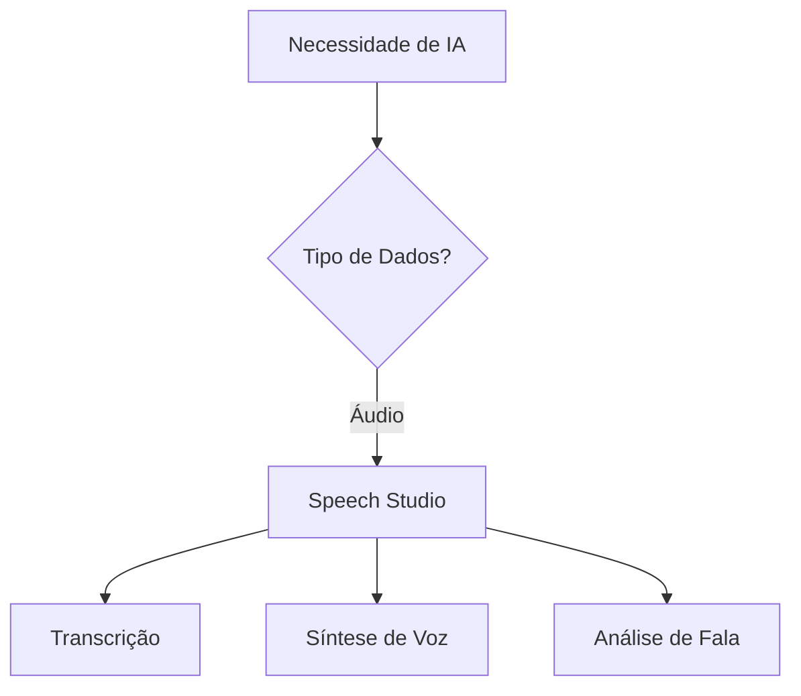
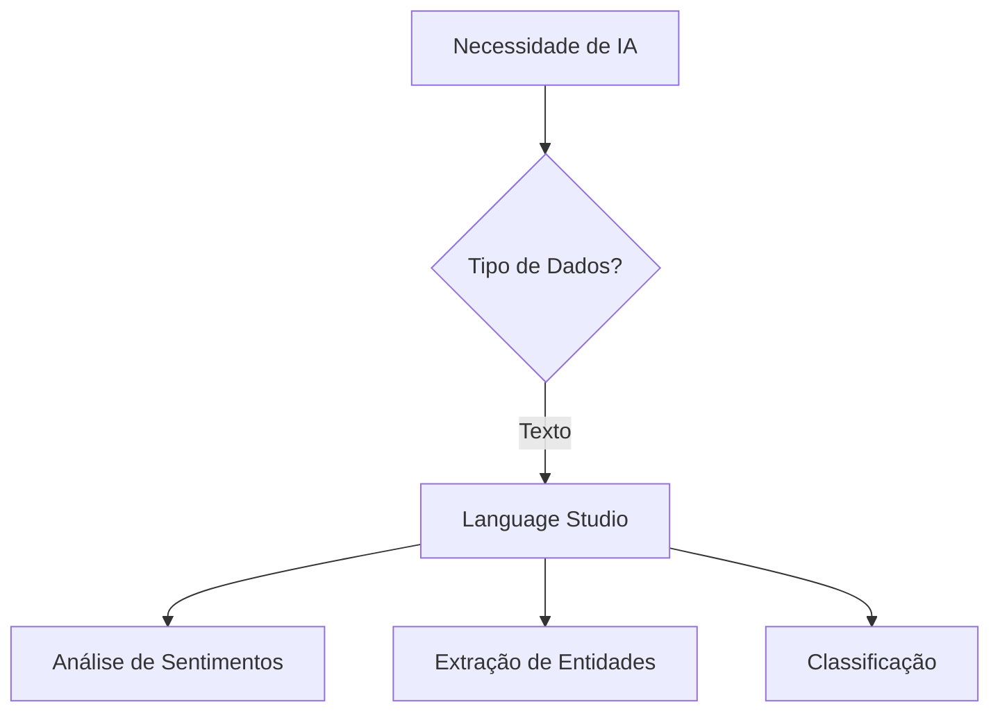

# 💡 Insights e Lições Aprendidas

## 🎯 Visão Geral

Este documento consolida os principais aprendizados, insights e reflexões obtidos durante a exploração prática do Azure Speech Studio e Language Studio.

## 🧠 Principais Descobertas

### 🎤 Azure Speech Studio

#### ✨ Descobertas Positivas
- **Qualidade Excepcional**: A precisão em português brasileiro surpreendeu positivamente
- **Facilidade de Uso**: Interface intuitiva permite prototipagem rápida
- **Vozes Naturais**: Text-to-speech com qualidade quase humana
- **Flexibilidade**: Suporte a múltiplos formatos e configurações

#### 🚧 Desafios Encontrados
- **Custo-Benefício**: Pricing pode ser proibitivo para uso intensivo
- **Limitações Regionais**: Sotaques muito específicos ainda são desafiadores
- **Dependência de Conectividade**: Requer internet estável para funcionar
- **Latência**: Em alguns casos, o tempo de resposta pode ser crítico

### 📝 Azure Language Studio

#### ✨ Pontos de Destaque
- **Versatilidade**: Múltiplas funcionalidades em uma única plataforma
- **Precisão Contextual**: Entende nuances do português brasileiro
- **Escalabilidade**: Processa grandes volumes eficientemente
- **Integração**: Conecta facilmente com outras ferramentas Azure

#### 🎯 Áreas de Melhoria
- **Contexto Cultural**: Ainda perde algumas referências culturais brasileiras
- **Linguagem Informal**: Performance reduzida com gírias e expressões coloquiais
- **Textos Muito Curtos**: Precisão limitada em mensagens muito breves
- **Sarcasmo**: Dificuldade em detectar ironia e sarcasmo

## 📊 Análise Comparativa

### Quando Usar Speech Studio


**Cenários Ideais:**
- Transcrição de reuniões e palestras
- Criação de assistentes virtuais
- Acessibilidade (legendas automáticas)
- Call centers e atendimento ao cliente

### Quando Usar Language Studio


**Cenários Ideais:**
- Análise de feedback de clientes
- Moderação de conteúdo
- Organização de documentos
- Extração de insights de textos

## 🎓 Lições Aprendidas

### 1. **Qualidade dos Dados é Fundamental**
- **Áudio limpo** = resultados melhores
- **Textos bem estruturados** = análises mais precisas
- **Pré-processamento** vale o investimento de tempo

### 2. **Context is King**
- Ferramentas funcionam melhor com **contexto adequado**
- **Domínio específico** pode requerer ajustes
- **Treinamento personalizado** pode ser necessário

### 3. **Prototipagem Rápida é Possível**
- Interfaces visuais permitem **testes imediatos**
- **Iteração rápida** acelera o desenvolvimento
- **Validação de conceito** fica mais acessível

### 4. **Integração é Chave**
- Ferramentas isoladas têm **valor limitado**
- **APIs robustas** facilitam integração
- **Ecossistema Azure** oferece sinergia

## 🚀 Aplicações Práticas Identificadas

### 💼 Cenários Corporativos

#### 1. **Centro de Atendimento Inteligente**
```yaml
Componentes:
  - Speech-to-Text: Transcrição de chamadas
  - Language Analysis: Análise de sentimentos
  - Classification: Categorização de problemas
  - Insights: Dashboard de qualidade

Benefícios:
  - Monitoramento em tempo real
  - Identificação proativa de problemas
  - Treinamento baseado em dados
```

#### 2. **Sistema de Análise de Feedback**
```yaml
Pipeline:
  1. Coleta: Reviews, emails, pesquisas
  2. Processamento: Language Studio
  3. Análise: Sentimentos + Entidades
  4. Ação: Alertas + Relatórios

ROI Esperado:
  - Redução 40% tempo de análise
  - Melhoria 25% satisfação cliente
```

### 🏥 Setor Saúde
- **Transcrição de consultas médicas**
- **Análise de feedback de pacientes**
- **Classificação de sintomas relatados**

### 🏫 Educação
- **Legendas automáticas para aulas**
- **Análise de redações e textos**
- **Assistentes virtuais educacionais**

## 📈 Métricas de Sucesso

### KPIs Técnicos
- **Precisão**: > 90% em cenários controlados
- **Latência**: < 3 segundos para textos médios
- **Disponibilidade**: 99.9% SLA
- **Escalabilidade**: Até 1000 req/min

### KPIs de Negócio
- **Redução de Custos**: 30-50% em tarefas manuais
- **Aumento de Produtividade**: 2-3x em análises
- **Melhoria na Experiência**: +25% satisfação
- **Time to Market**: 50% mais rápido

## 🔮 Tendências e Futuro

### Próximas Evoluções Esperadas
1. **Modelos Especializados**: Treinamento para domínios específicos
2. **Multilingual Avançado**: Suporte melhorado para português regional
3. **Integração com GPT**: Combinação com modelos generativos
4. **Edge Computing**: Processamento local para menor latência

### Oportunidades de Mercado
- **Automação de Processos**: RPA + IA Cognitiva
- **Análise em Tempo Real**: Streaming analytics
- **Personalização**: Experiências customizadas
- **Compliance**: Monitoramento automático

## 🎯 Recomendações Estratégicas

### Para Iniciantes
1. **Comece Pequeno**: Proof of concept antes de escalar
2. **Foque na Qualidade**: Dados limpos = resultados melhores
3. **Meça Constantemente**: KPIs claros desde o início
4. **Itere Rapidamente**: Feedback loop contínuo

### Para Empresas
1. **Estratégia Clara**: Defina objetivos específicos
2. **Equipe Multidisciplinar**: Técnicos + negócio + usuários
3. **Governança de Dados**: Privacidade e segurança
4. **Change Management**: Treinamento e adoção

### Para Desenvolvedores
1. **APIs First**: Pense em integração desde o início
2. **Monitoramento**: Logs e métricas em produção
3. **Fallbacks**: Planos B para quando IA falha
4. **Continuous Learning**: Modelos que evoluem

## 🏆 Conclusões Finais

### 💪 Pontos Fortes do Ecossistema
- **Maturidade Tecnológica**: Ferramentas prontas para produção
- **Facilidade de Uso**: Curva de aprendizado suave
- **Integração**: Ecossistema coeso e bem integrado
- **Suporte**: Documentação e comunidade ativas

### 🎯 Próximos Passos Recomendados
1. **Aprofundar Conhecimento**: Explorar APIs e SDKs
2. **Projetos Práticos**: Implementar casos de uso reais
3. **Certificações**: Azure AI Fundamentals e associadas
4. **Comunidade**: Participar de grupos e eventos

### 📝 Reflexão Pessoal
Esta jornada demonstrou que a IA Cognitiva não é mais ficção científica, mas uma realidade acessível e aplicável. O desafio agora é identificar onde aplicar essas tecnologias de forma eficaz e ética, sempre lembrando que a IA deve **aumentar** a capacidade humana, não **substituí-la**.
